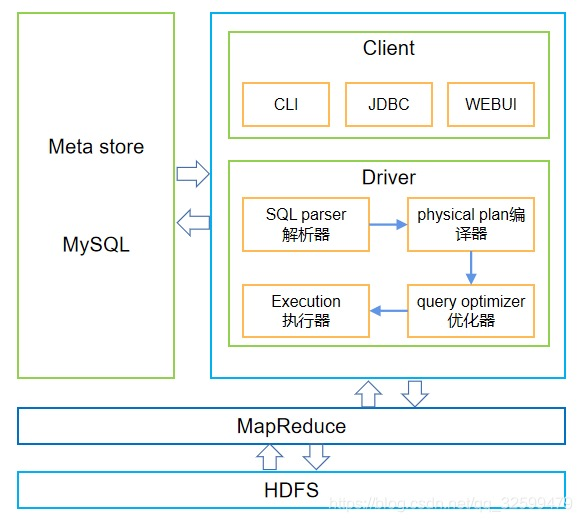
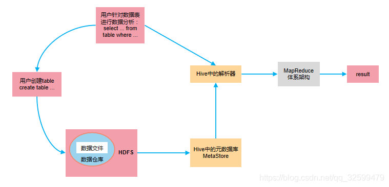

# Hive 学习笔记（一）

## Hive 定义
Hive是用于解决海量结构化日志的数据统计工具，是基于Hadoop的一个数据仓库工具，可以将结构化的数据文件映射为一张表，并提供类SQL查询功能。

## Hive 本质
Hive的本质就是将HQL转化成MapReduce程序。

## Hive 架构

* Client 用户接口  
  CLI（command-line interface）、JDBC/ODBC(jdbc访问hive)、WEBUI（浏览器访问hive）

* Metastore  
    元数据包括：表名、表所属的数据库（默认是default）、表的拥有者、列/分区字段、表的类型（是否是外部表）、表的数据所在目录等；默认存储在自带的derby数据库中，推荐使用MySQL存储Metastore

* SQL Parser 解析器  
    对SQL语句进行解析，转换成抽象语法树AST，并进行语法分析和检查

* Physical Plan 编译器  
    将抽象语法树AST编译成逻辑执行计划

* Query Optimizer 优化器  
    对逻辑执行计划进行优化

* Execution 执行器  
    将逻辑执行计划转换成可以运行的物理计划，也就是MR任务

## Hive与关系型数据库的区别

| 查询语言 | HiveQL | SQL |
| :----: | :----: | :----: |
| 数据存储位置 | HDFS | Raw Device or Local FS |
| 数据格式 | 用户定义 | 系统决定 |
| 数据更新 | 不支持 | 支持 |
| 索引 | 新版本支持（弱） | 支持 |
| 执行 | Map Reduace | Executor |
| 执行延迟 | 高 | 低 |
| 可扩展性 | 高 | 低 |
| 数据规模 | 大 | 小 |

## Hive 的优点 与 缺点
### 优点
1. 操作接口采用类SQL语法，提供快速开发的能力（简单、容易）
2. 避免写MapReduce程序，减少开发人员的学习成本
3. Hive优势在于处理大数据，常用于数据分析，适用于实时性要求不高的场景
4. hive支持用户自定义函数，用户可以根据自己的需求来实现自己的函数

### 缺点
1. Hive执行延迟比较高，对于处理小数据没有优势
2. hive的HQL表达能力有限（迭代式算法无法表达；数据挖掘方面不擅长，由于MapReduce数据处理流程的限制，效率更高的算法却无法实现）
3. hive的效率比较低（hive自动生成的MapReduce作业，通常情况下不够智能化；hive调优比较困难，粒度较粗）

## Hive 的工作机制
Hive通过给用户提供的一系列交互接口，接收到用户的指令(SQL)，使用自己的Driver，结合元数据(MetaStore)，将这些指令翻译成MapReduce，提交到Hadoop中执行，最后，将执行返回的结果输出到用户交互接口。

