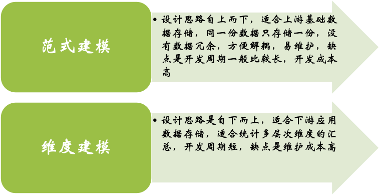
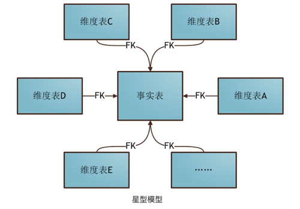
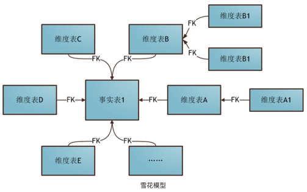
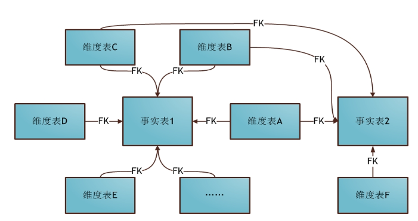
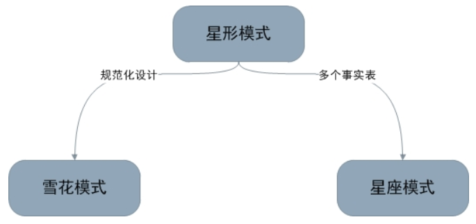
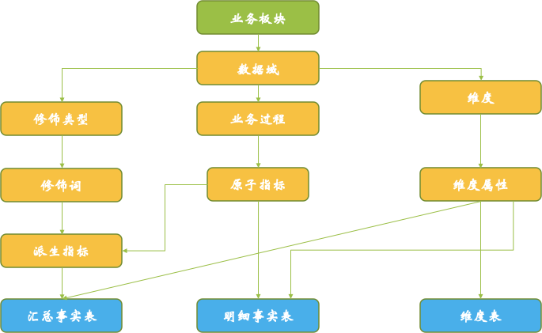

# 数仓建模

建模常见的方法主要分为**范式建模**和**维度建模**，两者思路是完全相反，根据其定义，在数据仓库中进行建模维度建模更适用。

本文主要介绍维度建模，其中维度建模，主要有三种方式：*星形模型*、*雪花模型*、*星座模型*

## 建模方式
**星形模型** 是一种非正规化的结构，多维数据集的每一个维度都直接与事实表相连接，不存在渐变维度，所以数据有一定的冗余。

**星形模型的维度建模由一个事实表和一组维度表组成，有以下特点：**

a. 维度表只和事实表关联，维度表之间没有关联；   
b. 每个维表的主键为单列，且该主码放置在事实表中，作为两边连接的外键；   
c. 以事实表为核心，维表围绕核心呈星形分布。    

___   

**雪花模型** 当有一个或多个维表没有直接连接到事实表上，而是通过其他维表连接到事实表上时，其图解就像多个雪花连接在一起，故称雪花模型。

雪花模型类似于星型模型，是对星型模型的扩展。 但是，在雪花模型中，维度被规范化为多个相关表，而星型模型的维度被非规范化，每个维度由单个表表示。

**雪花模型特点：** 将星形模式的大维度表拆分为小维度表，满足规范化设计，但不利于开发。
___   

**星座模型** 星座模式也是星型模式的扩展，星型模型和雪花模型都是基于多维表对应事实表，有的时候一个维度表可能被多个事实表用到，这个时候就需要采用星座模式。

### 差异性

**星型、雪花、星座三种模型的对比：**

雪花模型是将星型模型的维度表进一步划分，使得各维度表满足规范化设计。   
星座模型允许星型模型中出现多个事实表，更符合实际业务需求。

**总结:**    
1、数仓项目中，大多数时候是使用星型模型构建底层数据表，因为星型模型对OLAP的分析引擎支持比较友好，通过大量的冗余来减少表查询的次数从而提升查询效率；   
2、雪花模型在关系型数据库中如MySQL，Oracle中非常常见，尤其像电商的数据库表；实际中，常用的是星座模型，维度表关联多张事实表；

具体见下表：

| 属性 | 星形模型 | 雪花模型 | 
|:--:|:--:|:--:|
| 事实表 | 一个或多个 | 集中式 | 
| 维度表 | 一级 | 多级维表 | 
| 存储空间 | 多 | 少 | 
| 查询速度 | 快 | 慢 |
| 查询逻辑 | 易 | 难 |
| Join复杂度 | 易 | 难 |
| 冗余度 | 高 | 低 |
| 可读性 | 高 | 低 |
| 扩展性 | 差 | 好 | 
| 表数量 | 少 | 多 |
| 表宽度 | 宽 | 窄 |

## 指标 与 维度 
数据仓库自下而上的构建，就是为了获取各种维度下的指标统计量，来分析数据制定决策。

数仓中指标最基础指标为原子指标，也成为度量，用来表述最基础的信息，比如“元”，“用户数”等，在原子指标的基础上，会根据不同的场景生成派生/衍生指标;

规则是「原子指标+时间周期+修饰词」的组合。如：近7日销售额，近7日北京销售额。
当然通过原子指标加减乘除得到的指标也是派生/衍生指标。

