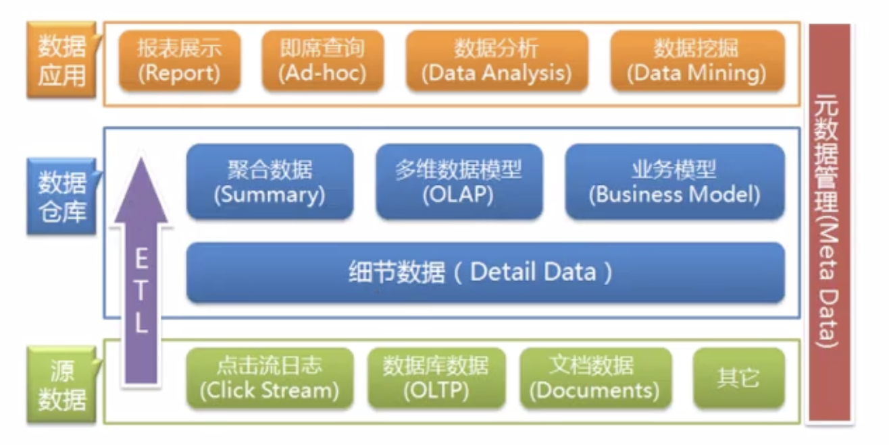

# 数仓理论学习（一）

## 数仓分层

### ODS 层 （Operation Data Store 原始数据层）  
原始数据层，存放原始数据，直接加载原始日志，数据。数据保存原貌不做处理，起到备份数据的作用。
数据采用压缩，减少磁盘存储空间（例如：原始数据100G，可以压缩到10G左右，LZO）
创建分区表，防止后续的全表扫描。

### DWD 层 (Data Warehouse Detail 明细数据层）  
对ODS层数据进行清洗（去除空值，脏数据，超过极限范围的数据），维度退化，脱敏等。
需构建维度模型，一般采用星型模型，呈现的状态一般为星座模型。

### DWS 层 （Data Warehouse Service 服务数据层）
以DWD为基础，按天进行轻度汇总。
统计各个主题对象的当天行为，服务于DWT层的主题宽表，以及一些业务明细数据，应对特殊需求（例如，购买行为，统计商品复购率）。

### DWT 层 （Data Warehouse Topic 主题数据层）
以DWS为基础，按主题进行汇总。
以分析的主题对象为建模驱动，基于上层的应用和产品的指标需求，构建主题对象的全量宽表。

### ADS 层 （Application Data Store 数据应用层）
为各种统计报表提供数据。

## 数仓分层的好处

**把复杂问题简单化：**  将复杂的任务分解成多层来完成，每一层只处理简单的任务，方便定位问题。

**减少重复开发：** 规范数据分层，通过中间层数据，能够减少极大的重复计算，增加一次计算结果的复用性。

**隔离原始数据：** 不论是数据的异常还是数据的敏感性，使真实数据和统计数据解耦开。

## 数据仓库命名规范

> 1、数据库命名  
>   规则：数仓对应分层  
>   命名示例：ods / dwd / dws/ dim / temp / ads  
> 
> 2、数仓各层对应数据库  
>   ods层:  ods_{业务线|业务项目}  
>   dw层:  dwd_{业务线|业务项目} + dws_{业务线|业务项目}  
>   dim层:  dim_维表  
>   ads层:  ads_{业务线|业务项目} (统计指标等)  
>   临时数据:  temp_{业务线|业务项目}  
>
> 3、表命名（数据库表命名规则）  
>   ODS层：  
>   命名规则：ods_{业务线|业务项目}_{数据来源类型}_{业务}  
> 
>   DWD层：  
>   命名规则：dwd_{业务线|业务项目}_{主题域}_{子业务}
>
>   DWS层：  
>   命名规则：dws_{业务线|业务项目}_{主题域}_{汇总相关粒度}_{汇总时间周期}
>  
>   ADS层：  
>   命名规则：ads_{业务线|业务项目}_{统计业务}_{报表form|热门排序topN}$$
>
>   DIM层：  
>   命名规则：dim_{业务线|业务项目|pub公共}_{维度}
> 
>   数据导入命名：
>   每日全量导入命名为：df (day full) 后缀  
>   每日增量导入命名为：di (day increase) 后缀  

