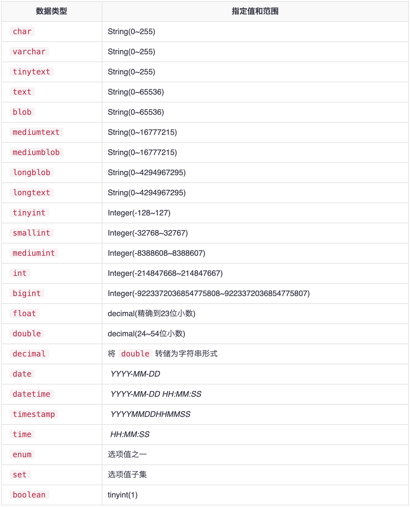

# 数据库相关

## 创建数据库
```SQL
CREATE DATABASE [IF NOT EXISTS] 'DB_NAME';
```

## 删除数据库
```SQL
DROP DATABASE [IF EXISTS] 'DB_NAME';
```

## 显示数据库
```SQL
SHOW DATABASES;
```

## 使用数据库
```SQL
USE 'DB_NAME';
```

# 数据表 table 相关

## 创建表
```SQL
CREATE TABLE [IF NOT EXISTS] table_name (
    column_name1 data_type[size] [NOT NULL | NULL] [DEFAULT VALUE] [AUTO_INCREMENT] [PRIMARY KEY | FORIGN KEY],
    column_name2 data_type[size] [NOT NULL | NULL] [DEFAULT VALUE] [AUTO_INCREMENT],
    ...

)ENGIN=table_type
```
>ENGIN 子句表示声明「存储引擎」，mysql 默认使用InnoDB，一般不指定   
>注：InnoDB自MySQL 5.5之后成为默认存储引擎。 InnoDB表类型带来了诸如ACID事务，引用完整性和崩溃恢复等关系数据库管理系统的诸多好处。在以前的版本中，MySQL使用MyISAM作为默认存储引擎。   

## 示例 
```SQL
CREATE TABLE IF NOT EXISTS tasks (
	task_id INT(11) NOT NULL AUTO_INCREMENT,
	subject VARCHAR(45) DEFAULT NULL,
	start_date DATE DEFAULT NULL,
	end_date DATE DEFAULT NULL,
	description VARCHAR(200) DEFAULT NULL,
	PRIMARY KEY (task_id)
)ENGINE=INNODB;
```   

## 删除表 
```SQL 
DROP TABLE IF EXISTS table_name;
```

## 表重命名
```SQL
RENAME TABLE old_table_name TO new_table_name;
```
> 旧表必须存在，新表必须不存在   


## 修改表
```SQL
ALTER TABLE table_name action_by_needs[, action2_by_needs, ...]
```

### 修改列
```SQL
ALTER TABLE tasks CHANGE COLUMN task_id task_id INT(20) NOT NULL AUTO_INCREMENT;
```

### 添加列
```SQL
ALTER TABLE tasks ADD COLUMN complete DECIMAL(2, 1) NULL 
``` 

### 删除列
```SQL
ALTER TABLE tasks DROP COLUMEN description;
```

### 重命名
```SQL
ALTER TABLE tasks RENAME TO new_table_name;
```

## 数据类型



## 插入数据
```SQL
INSERT INTO table_name(column_name1, column_name2, column_name3...) 
VALUES (value1, value2, value3...)
```

### 示例
```SQL
INSERT INTO tasks(subject, start_date, end_date, description)
VALUES("MySQL总结", "2020-05-20", "2020-05-21", "MySQL FRAME 学习总结");

# 插入多行
INSERT INTO tasks(subject, start_date, end_date, description)
VALUES("Golang总结", "2020-06-20", "2020-06-21", "Golang语言 学习总结"),
	  ("Python总结", "2020-07-20", "2020-07-21", "Python语言 学习总结"),
	  ("Java总结", "2020-08-20", "2020-08-21", "Java语言 学习总结");


# 查询A 表数据，插入B表
CREATE TABLE tasks_bak LIKE tasks;	#创建备份表
INSERT INTO tasks_bak SELECT * FROM tasks; #通过查询然后插入数据
```

## 更新数据 
```SQL
UPDATE table_name 
SET column_name1 = value1,
    column_name2 = value2, 
    column_name3 = value3
        ...
WHERE 
    conditions
```

### 示例
```SQL
# 更新单列
UPDATE tasks t SET t.description = "Java Language Review" WHERE subject="Java总结";

# 更新多列
UPDATE tasks SET start_date="2021-08-20", end_date="2021-08-21" WHERE task_id=9;

# 通过子查询来做数据更新 
UPDATE customers 
SET 
	salesRepEmployeeNumber = (
		SELECT 
			employeeNumber 
		FROM 
			employees 
		WHERE 
			jobtitle = 'Sales Rep' 
		ORDER BY RAND() 
		LIMIT 1
	)
WHERE 
	salesRepEmployeeNumber IS NULL;
```   


## 删除数据
```SQL
DELETE FROM table_name WHERE where_conditions;

# limit 子句，删除指定数量的行数row_count，如 10行,row_count=10, 即：limit 10;
DELETE FROM table_name WHERE where_conditions LIMIT row_count;
```

### 示例
```SQL
# 删除某一行数据
DELETE FROM tasks WHERE task_id = 2

# 删除所有数据
DELETE FROM tasks;
```

## 查询数据（*重点*）
`SELECT`语句用于从 表或视图 中获取数据。   
`SELECT`语句的结果成为结果集————行列表，每行都有相同的列数。

### SELECT 语法   
```SQL
SELECT 
    column1_name, column2_name,column3_name...
FROM 
    table1_name
[INNER | LEFT | RIGHT] JOIN table2_name ON conditions
WHERE 
    conditions
GROUP BY column_name
HAVING group_conditions
ORDER BY column_name
LIMIT offset, length;
```

SELECT语句由以下列表中所述的几个子句组成：

* **SELECT** 之后是逗号分隔列或星号(*)的列表，表示要返回所有列。
* **FROM** 指定要查询数据的表或视图。
* **JOIN** 根据某些连接条件从其他表中获取数据。
* **WHERE** 过滤结果集中的行。
* **GROUP BY** 将一组行组合成小分组，并对每个小分组应用聚合函数。
* **HAVING** 过滤器基于GROUP BY子句定义的小分组。
* **ORDER BY** 指定用于排序的列的列表。
* **LIMIT** 限制返回行的数量。

语句中的`SELECT`和`FROM`语句是必须的，其他部分是可选的。

## SELECT DISTINCT 查询子句
**SELECT DISTINCT**查询用于过滤掉重复的记录。

### SELECT DISTINCT 语法

```SQL
SELECT DISTINCT 
    columns_name
FROM 
    table_name
WHERE 
    where_conditions
```

**Tips:** 如果查询的列具有NULL值，并且对该列使用DISTINCT子句，MySQL将保留一个NULL值，并删除其它的NULL值，因为DISTINCT子句将所有NULL值视为相同的值。


